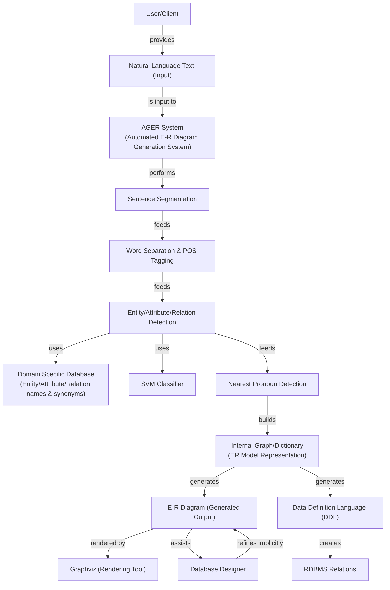

```mermaid
graph TD
    User_Client["User/Client"]
    Natural_Language_Text["Natural Language Text (Input)"]
    AGER_System["AGER System\n(Automated E-R Diagram Generation System)"]
    Sentence_Segmentation["Sentence Segmentation"]
    Word_Separation_POS["Word Separation & POS Tagging"]
    Domain_DB["Domain Specific Database\n(Entity/Attribute/Relation names & synonyms)"]
    SVM_Classifier["SVM Classifier"]
    Entity_Attribute_Relation["Entity/Attribute/Relation Detection"]
    Nearest_Pronoun["Nearest Pronoun Detection"]
    Internal_Graph["Internal Graph/Dictionary\n(ER Model Representation)"]
    ER_Diagram["E-R Diagram (Generated Output)"]
    Graphviz["Graphviz (Rendering Tool)"]
    DDL["Data Definition Language (DDL)"]
    RDBMS_Relations["RDBMS Relations"]
    Database_Designer["Database Designer"]

    User_Client -->|provides| Natural_Language_Text
    Natural_Language_Text -->|is input to| AGER_System
    AGER_System -->|performs| Sentence_Segmentation
    Sentence_Segmentation -->|feeds| Word_Separation_POS
    Word_Separation_POS -->|feeds| Entity_Attribute_Relation
    Entity_Attribute_Relation -->|uses| Domain_DB
    Entity_Attribute_Relation -->|uses| SVM_Classifier
    Entity_Attribute_Relation -->|feeds| Nearest_Pronoun
    Nearest_Pronoun -->|builds| Internal_Graph
    Internal_Graph -->|generates| ER_Diagram
    Internal_Graph -->|generates| DDL
    ER_Diagram -->|rendered by| Graphviz
    ER_Diagram -->|assists| Database_Designer
    DDL -->|creates| RDBMS_Relations
    Database_Designer -->|refines implicitly| ER_Diagram
```